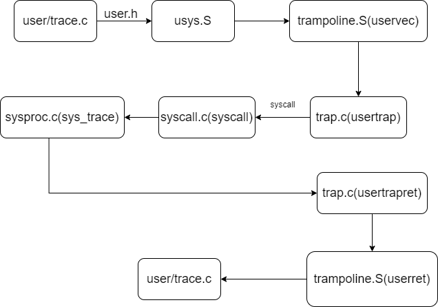

# 问题

- 命令行参数是如何放到 寄存器 a0、a1 中的？
- sys_sysinfo 中测试 0xeaeb0b5b00002f5e 是什么意思？

# system calls

首先在 user/user.h 中声明 c 文件（如trace.c , sysinfotest.c）所调用的系统调用。然而其真正的实现在


# 整个系统调用过程是如何进行的（以 trace 为例）




上述图片就是一个系统调用的基本过程。

这里还有一个问题就是命令行参数是如何放到 寄存器 a0、a1 中的？系统调用号在ecall时放到了a7寄存器，但是参数在usys.S中没有看到控制！


# 解答

```c
// sysproc.c

uint64
sys_trace(void)
{
  int mask;
  if(argint(0,&mask)<0)
      return -1;
  struct proc *p = myproc();
//  printf("mask value = %d\n",mask);
  if((mask & (mask-1) )==0 || mask == ~(1<<31)) {
      p->mask=mask;
  } else
    p->mask = 0;
  return 0;
}

uint64
sys_sysinfo(void)
{
    uint64 p;
//    uint64 de;
//  不知道测试0xeaeb0b5b00002f5e地址时什么意思，故先排除它
//  之后看看什么意思
    if(argaddr(0,&p)<0 || p==0xeaeb0b5b00002f5e)
        return -1;
//    printf("addr = %p\n",p);
    struct sysinfo info;
    info.freemem = freemem()*PGSIZE;
    info.nproc = nproc();
//    printf("freemem = %d,nproc = %d\n",info.freemem,info.nproc);
    if(copyout(myproc()->pagetable, p, (char *)&info, sizeof(info)) < 0)
        return -1;
    return 0;
}

```

```c

//syscall.c

void
syscall(void)
{
  int num;
  struct proc *p = myproc();
  char* syscallname[] = { "null","fork","exit","wait","pipe","read","kill","exec","fstat","chdir","dup","getpid","sbrk","sleep","uptime","open","write","mknod","unlink","link","mkdir","close","trace","sysinfo"};

  num = p->trapframe->a7;

  if(num > 0 && num < NELEM(syscalls) && syscalls[num]) {
    p->trapframe->a0 = syscalls[num]();
    int mask = p->mask; // 必须放在syscalls[num]()调用之后，只有syscall调用了才会给进程的mask字段赋值。
    if(mask==~(1<<31) || getPlace(mask)==num) {
        printf("%d: syscall %s -> %d\n", sys_getpid(), syscallname[num], p->trapframe->a0);
//        printf("num=%d\n",num);
    }
  } else {
    printf("%d %s: unknown sys call %d\n",
            p->pid, p->name, num);
    p->trapframe->a0 = -1;
  }
}

```

注：

int mask = p->mask; // 必须放在syscalls[num]()调用之后，只有syscall调用了才会给进程的mask字段赋值。

```c

//proc.c

int nproc(void)
{
    int n = 0;
    struct proc *p;
    for(p = proc; p < &proc[NPROC]; p++) {
        acquire(&p->lock);
        if(p->state != UNUSED)
            ++n;
        release(&p->lock);
    }
    return n;
}
```

```c

// kalloc.c

int freemem(void){
    int mem=0;
    struct run *r;
    acquire(&kmem.lock);
    r = kmem.freelist;
    while (r) {
        r = r->next;
        ++mem;
    }
    release(&kmem.lock);
    return mem;
}
```